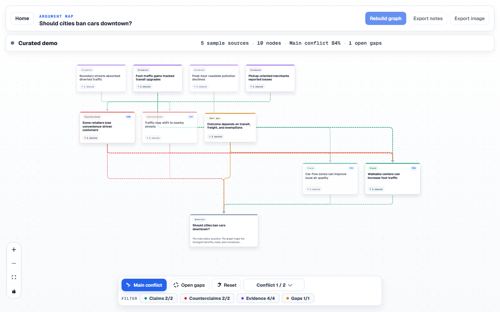
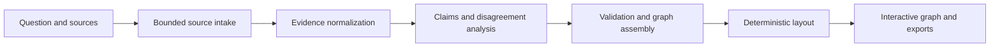

# ClaimGraph

> Visual argument mapping for difficult questions.

[Open ClaimGraph](https://claim-graph.vercel.app) | [Explore the demo](https://claim-graph.vercel.app/workspace/demo) | [Report a problem](https://github.com/TUPRAM/claim-graph/issues/new/choose)

[](https://www.typescriptlang.org/)
[](https://nextjs.org/)



ClaimGraph turns a contested question and optional source material into an
interactive map of claims, counterclaims, evidence, and unresolved gaps. Each
substantive node remains connected to its provenance so readers can inspect the
reasoning instead of accepting a long summary at face value.

## What it does

- Maps claims, counterclaims, evidence, and gaps as a readable graph.
- Keeps source and snippet provenance attached to every non-question node.
- Surfaces the strongest disagreement without hiding the rest of the map.
- Provides a focused inspector for sources, excerpts, relationships, and gaps.
- Accepts public links and bounded PDF, DOCX, Markdown, and text uploads.
- Exports the visible analysis as Markdown or a PNG snapshot.
- Preserves a curated demo when a connected analysis service is unavailable.
- Supports public read-only sharing while keeping owner actions capability
  protected.

## Product principles

ClaimGraph is built around a few strict rules:

1. The graph is the product; it is not a chat transcript.
2. Every substantive node must have provenance.
3. Confidence describes grounding and placement, not truth.
4. Counterclaims remain explicit.
5. Missing evidence and unresolved assumptions are first-class graph nodes.
6. Claims stay atomic and the visible graph stays readable.
7. Layout is deterministic application code, not generated coordinates.

## How it works



The application keeps evidence, claim inventory, and graph artifacts scoped to
one run. State changes are guarded so cancellation and stale retries cannot
publish a newer status or graph accidentally. Public responses are constructed
from explicit schemas rather than internal storage objects.

## Try it

- [Live application](https://claim-graph.vercel.app)
- [Curated demo workspace](https://claim-graph.vercel.app/workspace/demo)

The hosted application is a preview. Do not submit confidential, regulated, or
personally sensitive material. Shared workspace links are intentionally
read-only unless the browser also holds the workspace owner capability.

## Local development

### Requirements

- Node.js 24
- npm 11

### Start the app

```bash
git clone https://github.com/TUPRAM/claim-graph.git
cd claim-graph
npm ci
cp .env.example .env.local
npm run dev
```

On PowerShell, use `Copy-Item .env.example .env.local` instead of `cp` if
needed. Then open [http://localhost:3000](http://localhost:3000).

The checked-in defaults start in demo mode, so the interface can be explored
without connected services. Source-backed runs require a configured analysis
provider. Hosted persistence additionally requires a PostgreSQL database,
object storage, and the durable workflow runner. The complete configuration
surface is documented by comments in [`.env.example`](.env.example).

Never commit `.env.local`, access tokens, database credentials, or provider
keys.

## Common commands

| Command | Purpose |
| --- | --- |
| `npm run dev` | Start the local development server |
| `npm run typecheck` | Run strict TypeScript checks |
| `npm run test` | Run the complete Vitest suite |
| `npm run build` | Build the production application |
| `npm run audit:security` | Fail on high or critical production dependency findings |
| `npm run runtime:check` | Inspect local runtime readiness |
| `npm run qa:workspace` | Run browser-level workspace regression checks |

## Architecture

```text
app/                  Next.js pages and route handlers
components/           Graph, workspace, inspector, and shared UI
lib/graph/            Graph scoring, transforms, validation, and layout
lib/provenance/       Source identity, snippet binding, and public provenance
lib/providers/        Analysis-provider boundary
lib/server/           Lifecycle, storage, safety controls, and orchestration
lib/validation/       Persisted and public API schemas
tests/                Unit, integration, route, storage, and UI regression tests
types/                Shared domain types
workflows/            Durable hosted analysis workflow
```

The local adapter uses SQLite. The hosted adapter uses PostgreSQL-compatible
storage and object storage. Both runners share the same lifecycle semantics,
including one active run per workspace, guarded terminal states, run-scoped
artifacts, and graph-bound public snapshots.

## Security and privacy boundaries

- Public workspace links provide read-only access.
- Mutations require an unguessable owner capability or a protected developer
  session; only a hash of the owner capability is persisted.
- Browser mutations enforce the configured canonical origin.
- URL retrieval accepts only HTTP(S), rejects private and metadata targets,
  revalidates redirects, and streams within time and byte limits.
- Uploads are checked by content structure and bounded by request, page,
  decompression, and extracted-text budgets.
- Workspace creation, analysis, exports, uploads, paid runs, and provider
  concurrency have durable ceilings.
- A protected operations lane can pause analysis and inspect retryable cleanup
  without exposing those controls publicly.
- Public payloads use allowlisted schemas and redact internal metadata.

See [SECURITY.md](SECURITY.md) for responsible vulnerability reporting.

## Deployment

ClaimGraph supports two persistence shapes:

- Local or single-instance development with SQLite and filesystem storage.
- Hosted deployment with PostgreSQL-compatible storage, object storage, and a
  durable workflow runner.

Production deployments must configure the canonical HTTPS origin, strong
control secrets, cleanup authentication, retention settings, and bounded
resource limits. See [docs/deployment.md](docs/deployment.md) for the deployment
checklist.

## Quality gates

Before proposing a change, run:

```bash
npm run typecheck
npm run test
npm run build
npm run audit:security
```

The test suite covers graph invariants, provenance, public serialization,
workspace ownership, run lifecycle races, cancellation, storage adapters,
bounded retrieval and uploads, exports, retention, and browser-facing
regressions.

## Contributing

Bug reports and product proposals are welcome through GitHub Issues. ClaimGraph
is not currently accepting unsolicited external code contributions. Authorized
collaborators should read [CONTRIBUTING.md](CONTRIBUTING.md) before opening a
pull request.

## License

ClaimGraph is proprietary source-available software. An unmodified copy may be
downloaded, built, and run for internal non-commercial evaluation. Modification,
production deployment, service operation, redistribution, commercial use, and
derivative works require prior written permission from TUPRAM. See
[LICENSE](LICENSE) for the complete terms.
