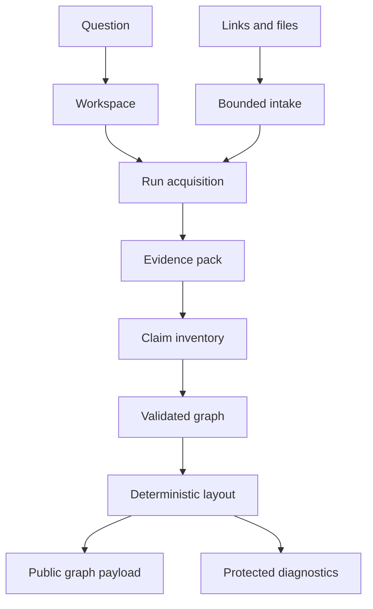

# Architecture

ClaimGraph is a full-stack TypeScript application built around a graph domain
model. The core artifacts are workspaces, runs, sources, snippets, evidence
packs, claim inventories, and rendered graphs.

## Request flow

The graph renderer never accepts generated coordinates. It receives validated
domain nodes and edges, then computes layout in application code.

## Domain invariants

- There is exactly one question node.
- Every non-question node references at least one source and snippet.
- Edges reference existing nodes and use a known relation.
- Confidence describes grounding and placement rather than objective truth.
- Claims are atomic; counterclaims and unresolved gaps remain explicit.
- Graph size and branch density are bounded for readability.

## Lifecycle

Local and hosted runners share one lifecycle kernel. Active stages are
monotonic and terminal states cannot return to active work.

Each stage reloads the current run before provider calls, artifact reads,
artifact writes, graph completion, and terminal transitions. Evidence and claim
inventory are retrieved by run identifier. Graph publication and completion are
atomic, preventing a stale retry from exposing a partial or newer graph.

One workspace has at most one active run. Concurrent Analyze requests acquire
or return that run transactionally. Cancellation is persisted before external
workflow cancellation is requested, so the database remains the final defense.

## Storage

Two adapters implement the same storage contract:

- Local development uses SQLite and filesystem-backed objects.
- Hosted deployments use PostgreSQL-compatible storage and private object
  storage.

Hosted single-flight and deletion use workspace-scoped transaction locks.
Partial unique indexes also enforce one active run per workspace. Versioned
compare-and-set transitions reject stale status updates.

## Public and protected APIs

Public workspace payloads use dedicated schemas for runs, graph nodes, sources,
snippets, and files. Unknown fields are rejected rather than copied from
internal records. Public graph status, artifacts, metrics, and provenance are
bound to the run that produced the displayed graph.

Protected developer routes expose deeper health, lifecycle, cleanup, and
provider diagnostics after server-side session or bearer authorization. Those
records are never spread into public payloads.

## Ownership and sharing

Workspace URLs are public read-only shares. The creator receives a random write
capability in an HttpOnly, SameSite cookie; only its hash is persisted. Browser
mutations also require the configured canonical origin. Explicit API clients
may provide the capability through the documented mutation header.

## Resource and input boundaries

Durable policy records govern workspace creation, analysis, exports, file
mutations, uploaded bytes, paid work, and provider concurrency. A protected kill
switch can pause analysis without a deployment.

URL retrieval validates scheme, credentials, DNS results, redirects, time, and
byte budgets. Uploads validate content structure and apply aggregate request,
page, entry, decompression, and extracted-text limits. Export writes either
complete in both object storage and the database or enter retryable cleanup.
